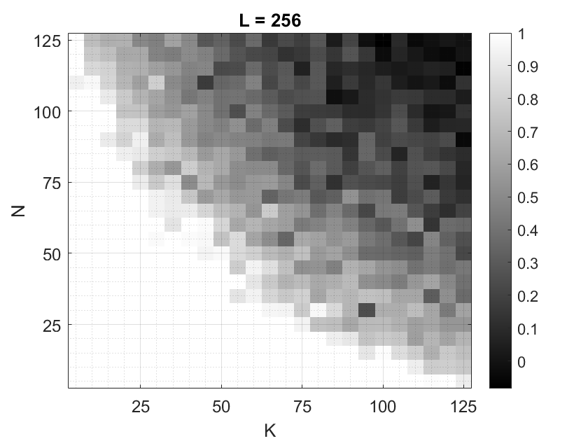

# Blind Deconvolution
*Wenyuan Zhao*

## Introduction

This repository provides a MATLAB implementation of [Blind Deconvolution](https://github.com/wyzhao030/blind-deconvolution/blob/main/ece273_blind_deconvolution.pdf).

A concise explanation can be found [here](https://ieeexplore.ieee.org/stamp/stamp.jsp?tp=&arnumber=6680763).

## Usage

* Basic blind deconvolution: [blind_deconv_convex.m](https://github.com/wyzhao030/blind-deconvolution/blob/main/src/blind_deconv_convex.m)
* Blind deconvolution in 2D: [blind2d.m](https://github.com/wyzhao030/blind-deconvolution/blob/main/src/blind2d.m)

Some output sample figures can be found in `figures` folder.

**Result:**

 

## Citation

If you find our work useful in your research, please consider cite this repository as follows:

```
@misc{blind-deconvolution,
    author = {Zhao, Wenyuan},
    title = {Blind Deconvolution},
    year = {2022},
    publisher = {GitHub},
    journal = {GitHub repository},
    howpublished = {\url{https://github.com/wyzhao030/blind-deconvolution}},
}
```

